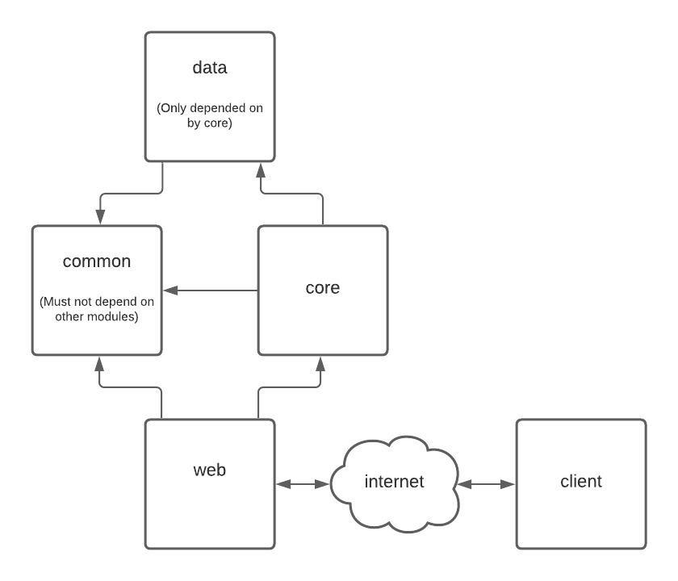

https://gitlab.com/nanodeath/ktor-session-auth-example

# Prerequisites

* Java 8
* NodeJS
* NPM
* Docker
* docker-compose

# Gradle
## Build the app
Tasks run from the root module cascade into each submodule, and if a task with the
same name exists, it will invoke alongside the root project.

For example, to build the entire project
    
    ./gradlew build
    
To build a specific module only, then use of \[`client`, `common`, `core`, `data`, `web`\]

    ./gradlew common:build

## Run the app
In the root of the repository, run

    $ ./gradlew build

This will produce a server artifact, located in the [web](web/build/libs/shadow.jar) module, and 
a client bundle.

Then, run

    $ docker-compose up
    
To start the app.  Only the web and client modules talk on the network.

    web: localhost:8080
    client: localhost:80

# Gradle Modules
The project consists of 5 modules that each contain a different app layer.

## data
The data module contains all the definitions for the postgres database.  This 
includes table definitions, entities and DAOs.  Database operations should be defined
here, but should not create or handle any sql transactions.  

## common
The common module contains data classes and other common definitions to be shared
between all other kotlin modules.  Business logic generally should not go here.
Common should not depend on any other module.

## core
The core module contains core business logic and acts as the intermediary layer
between database and the web server. 

## web
The web module is the serverside entrypoint to the app.  It starts a web server
and holds all the api routes.  This module is where the application configuration
resources are for the app and libraries such as ktor and flyway

## client
The only module that isn't kotlin, this module contains the ReactJS frontend which
is to be intended to be served using nginx.  client is built using webpack and can
be run using npm scripts.

    npm run build # bundle the client code with assets in client/build
    npm run watch # listens for changes in source files and auto-builds
    
client can be built from gradle using the task `build`, which runs `npm run build` under the hood

This image illustrates the dependencies between modules

# Data migrations

When performing a data migration, a few steps need to be taken.

## Exposed
First, in the `data` module, create/modify/delete any table definition, then update
entity definitions on that table.

## Flyway
Second, in the `web` module's resources folder.  Create a new file in db.migration
that follows the format `V#__Simple_Description.sql` where V# is the next incremented
number in the sequence consistent with all the other migration files.  This file should
be a valid postgres script.

For example: `V1__Add_Traveler_Table.sql` 

# TODO
